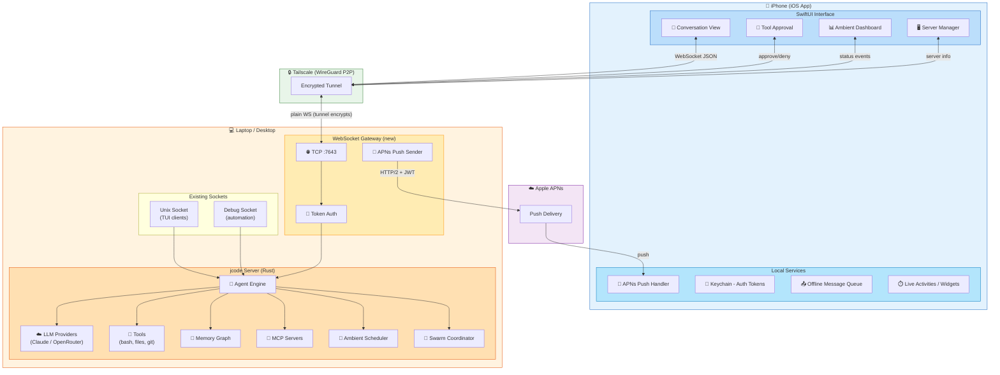
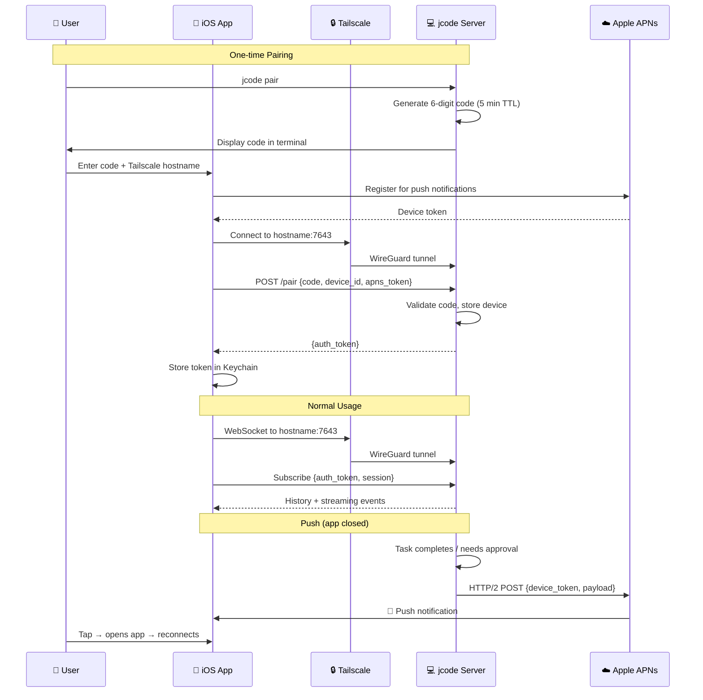

# jcode iOS Client

> **Status:** Phase 1 Swift app shell + SDK exists, but the product direction is
> Rust-first shared mobile app core with a Linux-native, agent-native app
> simulator. See [`MOBILE_AGENT_SIMULATOR.md`](MOBILE_AGENT_SIMULATOR.md).
> **Updated:** 2026-02-23

A native iOS application that connects to a jcode server running on the user's laptop or desktop. The phone is a rich, touch-optimized client; all heavy lifting (LLM calls, tool execution, file I/O, git, MCP) stays on the server.

The current Swift implementation is useful as a prototype and platform shell,
but it should not remain the source of truth for app behavior. Shared mobile
state, protocol handling, semantic UI, and simulator automation should move into
Rust so that agents can iterate on the app on Linux without MacBook, Xcode,
Apple iOS Simulator, or a physical iPhone.

---

## Architecture



### Connection Flow



---

## Why This Architecture

jcode's value is **tool execution**: running shell commands, editing files, managing git repos, connecting to MCP servers. None of that is possible inside iOS's sandbox. So the server must exist regardless.

What the phone adds:
- **Mobility** - interact with jcode from the couch, on the bus, in a meeting
- **Ambient display** - phone on desk showing agent progress, task status, memory activity
- **Push notifications** - know when a task finishes, approve tool calls from lock screen
- **Touch UX** - purpose-built interface instead of terminal emulation

What the phone does NOT do:
- Run bash commands
- Access the filesystem
- Host MCP servers
- Run LLM inference locally

---

## Server-Side Changes

The jcode server currently speaks newline-delimited JSON over Unix sockets. The iOS client needs the same protocol over a network transport. Changes required:

### 1. WebSocket Gateway

A new network listener alongside the existing Unix socket. Same protocol, different transport.

```
                  ┌─────────────────────────┐
                  │      jcode server        │
                  │                          │
   Unix socket ──►│  session manager         │◄── WebSocket (new)
   (TUI client)   │  agent engine            │    (iOS client)
                  │  tool registry           │
   Debug socket ─►│  swarm coordinator       │
                  └─────────────────────────┘
```

**Location in code:** New module `src/gateway.rs` (or extend `src/server.rs`)

**Key decisions:**
- Listen on a configurable TCP port (default: `7643` - "jc" on phone keypad)
- Over Tailscale: plain WebSocket (tunnel provides encryption)
- Fallback without Tailscale: TLS required (self-signed or Let's Encrypt)
- WebSocket upgrade on `/ws` endpoint
- REST endpoints for health and pairing: `GET /health`, `POST /pair`
- Same `Request`/`ServerEvent` JSON protocol as Unix socket

**Minimal diff to protocol:**
- No protocol changes needed. The existing `Request` and `ServerEvent` enums work over WebSocket as-is.
- Add a `Subscribe` variant field for client type (`tui` vs `ios`) so the server can tailor events (e.g., send push-worthy notifications differently).

### 2. Authentication

Unix sockets are authenticated by filesystem permissions. Network sockets need explicit auth.

```
Pairing Flow:
                                                         
  1. User runs: jcode pair                               
     → Server generates a 6-digit pairing code           
     → Displays it in terminal                           
     → Code valid for 5 minutes                          
                                                         
  2. User enters code in iOS app                         
     → App sends code + device ID to server              
     → Server validates, returns a long-lived auth token  
     → Token stored in iOS Keychain                      
                                                         
  3. All subsequent connections use Bearer token          
     → Token included in `Authorization: Bearer <token>` on WebSocket upgrade request       
     → Server validates against stored device list        

  Config: ~/.jcode/devices.json
  [
    {
      "id": "iphone-14-jeremy",
      "name": "Jeremy's iPhone",
      "token_hash": "sha256:...",
      "paired_at": "2025-02-21T...",
      "last_seen": "2025-02-21T..."
    }
  ]
```

### 3. Connectivity (Tailscale-first)

The iOS app connects to the jcode server over **Tailscale** as the primary transport. No LAN-only discovery, no mDNS fragility, no port forwarding.

**Why Tailscale-first:**
- Works from anywhere - home, coffee shop, cellular, different country
- Already encrypted (WireGuard) - no TLS cert management on our side
- Stable hostnames (`laptop.tail1234.ts.net`) that survive network changes
- Punches through NAT automatically
- Tailscale has a native iOS app, so the phone is already on the network

```
iPhone                     Tailscale Network              Laptop
(Tailscale app)            (WireGuard mesh)               (tailscaled)
     │                            │                           │
     │  jcode iOS app connects to laptop.tail1234.ts.net:7643 │
     │────────────── encrypted WireGuard tunnel ──────────────►│
     │                                                        │
     │◄───────── WebSocket (plain, tunnel is encrypted) ─────►│
```

**Setup flow:**
1. User installs Tailscale on both phone and laptop (most devs already have this)
2. jcode server binds to Tailscale IP (or `0.0.0.0` and Tailscale handles routing)
3. iOS app asks for Tailscale hostname on first launch (e.g. `laptop` or `100.88.154.108`)
4. Connection goes through WireGuard tunnel - encrypted, works everywhere
5. Server can also use Tailscale's MagicDNS for human-friendly names

**Fallback options (not primary):**
- **Manual IP/hostname** - for users not on Tailscale, enter `hostname:port` directly
  Requires TLS (self-signed or Let's Encrypt) since there's no tunnel encryption.
- **LAN Bonjour** - possible future addition, but not worth the complexity upfront.
  mDNS is flaky on corporate/guest WiFi and only works on same network.

**No cloud relay needed** - Tailscale is peer-to-peer. Traffic goes directly between phone and laptop, even across networks. No jcode server in the cloud.

### 4. Push Notifications (APNs)

Native push notifications via Apple Push Notification Service. Since we're building a native iOS app, we use APNs directly - no third-party services in the loop.

```
jcode server                     Apple APNs              iPhone
(your laptop)                    (Apple cloud)           (jcode app)

Event fires ───► HTTP/2 POST ──► Routes push ──► 🔔 Native push
                 to APNs with    to device        notification
                 device token                     in jcode app
                 + JWT signing
```

**How it works:**
- Apple Developer Account provides an APNs key (.p8 file)
- The .p8 key is stored on the jcode server (`~/.jcode/apns/`)
- iOS app registers for push on launch, gets a device token from Apple
- Device token is sent to jcode server during pairing (stored in `devices.json`)
- To send a push: jcode server signs a JWT with the .p8 key, POSTs to `api.push.apple.com`
- Rust crate: `a2` (APNs client) or raw HTTP/2 via `hyper`/`reqwest`

**Pairing flow handles token exchange naturally:**
```
iPhone                              jcode server
  │                                      │
  │  Register for push with Apple        │
  │◄──── device token ────────────────   │
  │                                      │
  │  Pair with server (6-digit code)     │
  │  + send device token ──────────────► │
  │                                      │  Store in devices.json:
  │  ◄──── auth token ─────────────────  │  { token, device_token,
  │                                      │    apns_token: "abc..." }
  │  Done. Server can now push to this   │
  │  device at any time.                 │
```

**Events worth pushing:**
- Task/message completed (agent finished a turn)
- Tool approval requested (safety system Tier 2 action) - actionable notification
- Ambient cycle completed (with summary)
- Server going offline / coming back online
- Swarm task assigned to you

**Rich notification features (APNs enables all of these):**
- **Actionable notifications** - Approve/Deny tool calls from lock screen
- **Live Activities** - Show task progress on lock screen and Dynamic Island
- **Notification grouping** - Group by session (all fox notifications together)
- **Silent pushes** - Update app state in background without alerting user
- **Critical alerts** - For safety-tier actions that need immediate attention

### 5. Image/File Transfer

The iOS client needs to send images (screenshots, photos) and receive file previews.

```
iOS → Server:
  - Images attached to messages (already supported: Request::Message has images field)
  - Base64-encoded in the JSON payload (existing pattern)
  - Consider chunked upload for large files

Server → iOS:
  - Code snippets with syntax highlighting (rendered client-side)
  - File tree snapshots (for browsing)
  - Image tool outputs (screenshots, diagrams)
```

---

## iOS App Design

### Screen Flow

```
┌─────────────┐     ┌─────────────┐     ┌─────────────┐
│  Server      │     │  Session     │     │  Ambient     │
│  Discovery   │────►│  List        │────►│  Dashboard   │
│              │     │              │     │              │
│  - Scanning  │     │  - Active    │     │  - Status    │
│  - Manual    │     │  - Resume    │     │  - History   │
│  - Pair new  │     │  - New       │     │  - Schedule  │
└─────────────┘     └──────┬───────┘     └─────────────┘
                           │
                           ▼
                    ┌─────────────┐
                    │  Chat View   │
                    │              │
                    │  - Messages  │
                    │  - Tools     │
                    │  - Status    │
                    └─────────────┘
```

### Chat View (Primary)

Redesigned for touch. NOT a terminal emulator.

```
┌──────────────────────────────────────┐
│ ◄  🦊 fox on 🔥 blazing     ⚙️  ⋮  │  ← Navigation bar
├──────────────────────────────────────┤
│                                      │
│  ┌──────────────────────────────┐   │
│  │ 👤 Can you refactor the auth │   │  ← User message (bubble)
│  │    module to use OAuth2?     │   │
│  └──────────────────────────────┘   │
│                                      │
│  ┌──────────────────────────────┐   │
│  │ 🤖 I'll refactor the auth   │   │  ← Assistant message
│  │    module. Let me start by   │   │
│  │    reading the current code. │   │
│  │                              │   │
│  │  ┌────────────────────────┐  │   │
│  │  │ 📄 file_read           │  │   │  ← Tool call (collapsible card)
│  │  │ src/auth.rs            │  │   │
│  │  │ ✅ 245 lines           │  │   │
│  │  └────────────────────────┘  │   │
│  │                              │   │
│  │  ┌────────────────────────┐  │   │
│  │  │ ✏️ file_edit            │  │   │  ← Another tool call
│  │  │ src/auth.rs            │  │   │
│  │  │ ⏳ running...           │  │   │
│  │  │ [View Diff]            │  │   │
│  │  └────────────────────────┘  │   │
│  │                              │   │
│  └──────────────────────────────┘   │
│                                      │
├──────────────────────────────────────┤
│ ┌──────────────────────────┐  📎 🎤 │  ← Input bar
│ │ Message jcode...         │  ⬆️    │
│ └──────────────────────────┘        │
└──────────────────────────────────────┘
```

**Key UX elements:**
- Tool calls as collapsible cards (tap to expand output)
- Diff viewer for file edits (swipe to see before/after)
- Syntax-highlighted code blocks
- Image attachments via camera/photo picker (📎)
- Voice input (🎤) for hands-free
- Swipe right on a message to reply/interrupt
- Pull down to see token usage, model info

### Ambient Dashboard

The killer feature for iOS. Shows what jcode is doing autonomously.

```
┌──────────────────────────────────────┐
│          Ambient Mode                │
├──────────────────────────────────────┤
│                                      │
│  Status: 🟢 Scheduled               │
│  Next wake: 12 minutes              │
│                                      │
│  ┌──────────────────────────────┐   │
│  │  Last Cycle (35 min ago)      │   │
│  │                               │   │
│  │  ✅ Merged 3 duplicate        │   │
│  │     memories                  │   │
│  │  ✅ Pruned 2 stale facts      │   │
│  │  ✅ Extracted memories from    │   │
│  │     crashed session           │   │
│  │  📝 0 compactions             │   │
│  │                               │   │
│  │  [View Full Transcript]       │   │
│  └──────────────────────────────┘   │
│                                      │
│  ┌──────────────────────────────┐   │
│  │  Scheduled Queue (2 items)    │   │
│  │                               │   │
│  │  ⏰ Check CI for auth PR      │   │
│  │     in 12 min (normal)        │   │
│  │  ⏰ Review stale TODO items   │   │
│  │     in 45 min (low)           │   │
│  └──────────────────────────────┘   │
│                                      │
│  ┌──────────────────────────────┐   │
│  │  Memory Health                │   │
│  │  ████████████░░ 847 memories  │   │
│  │  12 new today, 3 pruned       │   │
│  └──────────────────────────────┘   │
│                                      │
│  [ Pause Ambient ] [ Run Now ]       │
│                                      │
└──────────────────────────────────────┘
```

### Tool Approval (Push Notification)

When the safety system requires approval for a Tier 2 action:

```
┌──────────────────────────────────────┐
│  🔔 jcode needs approval            │
│                                      │
│  🦊 fox wants to run:               │
│                                      │
│  ┌──────────────────────────────┐   │
│  │  rm -rf target/              │   │
│  │                              │   │
│  │  Reason: Clean build after   │   │
│  │  dependency update           │   │
│  └──────────────────────────────┘   │
│                                      │
│  ┌─────────┐     ┌──────────────┐   │
│  │  Deny   │     │   Approve    │   │
│  └─────────┘     └──────────────┘   │
│                                      │
│  [ Always allow for this session ]   │
│                                      │
└──────────────────────────────────────┘
```

This should also work as an actionable push notification on the lock screen.

### Server Manager

```
┌──────────────────────────────────────┐
│          Servers                      │
├──────────────────────────────────────┤
│                                      │
│  ┌──────────────────────────────┐   │
│  │  🔥 blazing                   │   │
│  │  v0.3.3 (abc1234)            │   │
│  │  192.168.1.42:7643           │   │
│  │  🟢 Online  ·  2 sessions    │   │
│  │                               │   │
│  │  🦊 fox  · 5 min ago         │   │
│  │  🦉 owl  · 2 hours ago       │   │
│  └──────────────────────────────┘   │
│                                      │
│  ┌──────────────────────────────┐   │
│  │  ❄️ frozen                    │   │
│  │  v0.3.2 (def5678)            │   │
│  │  🔴 Offline                   │   │
│  │                               │   │
│  │  [ Wake Server ]              │   │
│  └──────────────────────────────┘   │
│                                      │
│  ┌──────────────────────────────┐   │
│  │  + Add Server                 │   │
│  │  Scan LAN · Manual · Pair    │   │
│  └──────────────────────────────┘   │
│                                      │
└──────────────────────────────────────┘
```

---

## Protocol Extensions

The existing `Request`/`ServerEvent` protocol works as-is over WebSocket. A few additions:

### New Request Types

```rust
// Client identifies itself on connect
#[serde(rename = "identify")]
Identify {
    id: u64,
    client_type: String,      // "ios", "tui", "web"
    device_name: String,       // "Jeremy's iPhone"
    device_id: String,         // Stable device identifier
    app_version: String,       // "1.0.0"
    capabilities: Vec<String>, // ["push", "images", "voice"]
}

// Request server info without subscribing to a session
#[serde(rename = "server_info")]
ServerInfo { id: u64 }

// Approve/deny a safety permission request
#[serde(rename = "permission_response")]
PermissionResponse {
    id: u64,
    request_id: String,
    approved: bool,
    remember: bool,  // "always allow for this session"
}
```

### New ServerEvent Types

```rust
// Permission request (push-worthy)
#[serde(rename = "permission_request")]
PermissionRequest {
    request_id: String,
    session_id: String,
    action: String,         // "shell_exec", "file_write", etc.
    detail: String,         // "rm -rf target/"
    tier: u8,               // Safety tier (1, 2, 3)
}

// Server info response
#[serde(rename = "server_info")]
ServerInfoResponse {
    id: u64,
    server_name: String,
    server_icon: String,
    version: String,
    sessions: Vec<SessionSummary>,
    ambient_status: String,
    uptime_secs: u64,
}

// Ambient cycle completed (push-worthy)
#[serde(rename = "ambient_cycle_done")]
AmbientCycleDone {
    summary: String,
    memories_modified: usize,
    next_wake_minutes: Option<u64>,
}
```

---

## Development Plan

### Phase 0: WebSocket Gateway (Rust, on Linux)

No Mac needed. Build and test entirely on Linux.

1. Add WebSocket listener to jcode server (`src/gateway.rs`)
   - Depends on: `tokio-tungstenite` (already in Cargo.toml)
   - Listen on configurable TCP port (default: `7643`)
   - Bridge WebSocket frames to existing Unix socket protocol
2. Add token-based authentication
   - Pairing command: `jcode pair`
   - Device registry: `~/.jcode/devices.json`
3. Tailscale connectivity
   - Bind to `0.0.0.0` (Tailscale routes traffic through WireGuard)
   - Optionally bind only to Tailscale interface for security
   - Document setup: install Tailscale on phone + laptop
4. Test with `websocat` or a simple Python script over Tailscale

**Deliverable:** Any WebSocket client can connect to jcode server over Tailscale, authenticate, and interact with sessions. Testable from Linux with CLI tools.

### Phase 1: Minimal iOS Client (needs Mac)

Borrow the MacBook for initial setup, then iterate.

1. Xcode project setup
   - SwiftUI app targeting iOS 17+
   - WebSocket connection (URLSessionWebSocketTask)
   - Server connection via Tailscale hostname
2. Pairing flow
   - Enter 6-digit code
   - Store token in Keychain
3. Basic chat view
   - Send messages, display responses
   - Show streaming text deltas
   - Display tool calls as cards
4. Session management
   - List sessions, create new, resume existing

**Deliverable:** Working iOS app that can chat with jcode.

### Phase 2: Rich UX

5. Tool call cards with expandable output
6. Diff viewer for file edits
7. Syntax highlighting (use a Swift library, e.g., Splash or Highlightr)
8. Image attachments (camera + photo library)
9. Voice input (iOS Speech framework)
10. Haptic feedback for events

### Phase 3: Ambient Mode + Notifications

11. APNs push notification integration
12. Ambient dashboard (status, history, schedule, memory health)
13. Tool approval via push notification (actionable)
14. iOS widgets (WidgetKit) for ambient status on home screen
15. Live Activities for long-running tasks

### Phase 4: Polish + Distribution

16. Dark/light theme (respect system setting)
17. iPad layout (split view, sidebar)
18. Offline mode (queue messages, sync when reconnected)
19. TestFlight beta distribution
20. App Store submission

---

## What You Need From the MacBook

**One-time setup (2-3 hours):**
- Install Xcode (free, ~20 GB download)
- Apple Developer account ($99/year for App Store, free for personal sideloading)
- Create Xcode project, configure signing
- Connect iPhone via USB, enable Developer Mode

**Ongoing development:**
- Write Swift code anywhere (even on Linux in a text editor)
- Use the Mac only for: building, signing, deploying to phone
- Could also use GitHub Actions macOS runners for CI builds
- Xcode Cloud (free tier: 25 compute hours/month) for automated builds

**Sideloading limitation (free account):**
- Apps expire every 7 days, need to re-deploy
- Limited to 3 apps per device
- No TestFlight distribution
- Worth it for prototyping; get the paid account when ready to share

---

## Tech Stack

| Component | Technology | Notes |
|-----------|-----------|-------|
| **iOS UI** | SwiftUI | Modern, declarative, good for our UX |
| **Networking** | URLSessionWebSocketTask | Native iOS WebSocket, no dependencies |
| **Connectivity** | Tailscale + URLSession | Tailscale tunnel, plain WebSocket inside |
| **Auth tokens** | Keychain Services | Secure, persists across app installs |
| **Push notifications** | APNs (native) | Direct Apple push, no third-party relay |
| **Syntax highlighting** | Splash or Highlightr | Swift libraries for code rendering |
| **Widgets** | WidgetKit | Home screen ambient dashboard |
| **Live Activities** | ActivityKit | Lock screen task progress |
| **Server WebSocket** | tokio-tungstenite | Already a dependency |
| **Server TLS** | rustls (fallback only) | Only needed for non-Tailscale connections |

---

## Security Considerations

- **Tailscale provides encryption** - WireGuard tunnel encrypts all traffic. TLS only needed for non-Tailscale fallback connections.
- **Auth tokens** stored in iOS Keychain, server stores only hashes
- **Pairing codes** are time-limited (5 min) and single-use
- **Device revocation** via `jcode pair --revoke <name-or-id>`
- **No credentials on the phone** - API keys, OAuth tokens stay on the server
- **Tool approval** for destructive actions even when triggered from iOS
- **Rate limiting** on the WebSocket gateway to prevent abuse

---

## Practical Setup: iPhone -> yashmacbook -> Xcode

For the current implementation, the iOS side in this repo is `JCodeKit` (networking + protocol layer), and the server-side gateway/pairing flow is live. Use this sequence to get reliable access to your Mac from iPhone:

1. On `yashmacbook`, enable gateway in `~/.jcode/config.toml`:

```toml
[gateway]
enabled = true
port = 7643
bind_addr = "0.0.0.0"
```

2. Restart jcode server on `yashmacbook`.
3. Ensure Tailscale is logged in on both iPhone and `yashmacbook`.
4. Generate pairing code on `yashmacbook`:

```bash
jcode pair
```

5. In iOS client, connect to the host printed by `jcode pair` (or set `JCODE_GATEWAY_HOST` on Mac to force the exact hostname shown).
6. Pair with the 6-digit code, then connect over WebSocket.
7. Ask jcode to run Xcode workflows on the Mac via tools, for example:
   - `xcodebuild -list`
   - `xcodebuild -scheme <Scheme> -destination 'platform=iOS Simulator,name=iPhone 15' build`
   - `xed .` (open current project in Xcode)

Because jcode executes tools on `yashmacbook`, this gives you "use Xcode through iPhone" behavior: the phone is the control surface, Mac runs Xcode/build commands.

### Current in-repo iOS implementation (Phase 1)

The repo now includes both:

- `JCodeKit` (`ios/Sources/JCodeKit`) - transport/protocol SDK
- `JCodeMobile` (`ios/Sources/JCodeMobile`) - SwiftUI app shell for pairing + chat

Implemented app flow:

1. Enter host/port and run health check (`GET /health`).
2. Pair using 6-digit code (`POST /pair`).
3. Save credentials locally and select among paired servers.
4. Connect over WebSocket to `/ws` with auth token.
5. Chat with streaming deltas and `text_replace` handling.
6. View and switch sessions from server-provided session list.

Notes:

- Credentials are currently persisted by `CredentialStore` in app support JSON.
- APNs push, ambient dashboard, and lock-screen tool approvals remain Phase 2/3 items.

### Build/run on a Mac (Xcode)

If `xcodegen` is installed on your Mac:

1. Install XcodeGen if needed:

```bash
brew install xcodegen
```

2. Generate the Xcode project:

```bash
cd ios
xcodegen generate
```

3. Open `ios/JCodeMobile.xcodeproj` in Xcode.

If you don't want to install XcodeGen, manually create an iOS app target in Xcode and add `../ios` as a local Swift Package dependency (product: `JCodeKit`).

4. Select the `JCodeMobile` scheme and an iPhone simulator or your device.
5. Build and run.

`project.yml` already wires the app target (`JCodeMobile`) to the local `JCodeKit` package product.


### End-to-end checklist for your goal (iPhone -> yashmacbook -> Xcode commands)

1. On Mac: enable and restart jcode gateway.
2. On Mac: run `jcode pair` and copy the code.
3. On iPhone app: pair to `yashmacbook` (or its Tailscale DNS name).
4. Connect and send command requests like:
   - `xcodebuild -list`
   - `xcodebuild -scheme <Scheme> -destination 'platform=iOS Simulator,name=iPhone 15' build`
   - `xed .`

Success condition: commands execute on `yashmacbook` and stream results back to iPhone chat.

---

## Open Questions

1. **Wake-on-LAN** - Can the iOS app wake a sleeping desktop? Would need WoL support in the server manager. Tailscale has some "always on" features that might help.
2. **Multiple servers** - The server manager UI supports this, but how to handle sessions spanning servers?
3. **Offline mode** - How much should the app cache? Full conversation history? Just recent messages?
4. **iPad as primary** - Should iPad support be a first-class goal or a stretch? Split view with code preview could be powerful.
5. **Keyboard shortcuts** - iPad with keyboard should feel native (Cmd+Enter to send, etc.)
6. **Tailscale requirement** - Should we require Tailscale, or invest in a non-Tailscale path early? Most developer users likely already use it or a similar overlay network.
