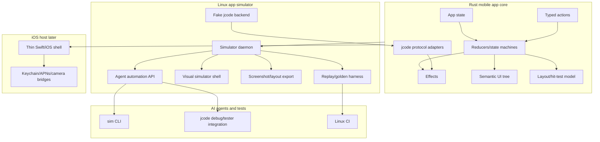

# Agent-Native Mobile App Simulator

This document defines the intended direction for the jcode mobile simulator.

## Product definition

The simulator is a **Linux-native simulator for the jcode mobile application itself**.

It is not Apple iOS Simulator, not an iPhone mirror, and not a thin mock that only checks a few reducer states. Its purpose is to let humans and AI agents build, run, inspect, test, and iterate on the mobile application without a MacBook, Xcode, or a live iPhone.

The mobile application implementation should be **Rust-first**. The iOS app should eventually be a thin platform host around a shared Rust application core, renderer/model boundary, protocol layer, and automation-compatible semantics.

## Goals

1. Run the mobile app experience on Linux from a normal checkout.
2. Exercise the same Rust app core that ships inside the iOS app.
3. Let AI agents test autonomously in every way a human would: inspect, tap, type, scroll, gesture, wait, assert, capture screenshots, compare layout/image output, and replay failures.
4. Avoid requiring Mac hardware, Xcode, Apple iOS Simulator, or a physical iPhone for day-to-day iteration.
5. Keep native iOS-only pieces isolated behind small platform-shell interfaces.

## Non-goals

- It is not a replacement for final iOS device validation.
- It does not need to simulate all of UIKit, SwiftUI, or iOS internals.
- It should not rely on brittle OCR-only or screenshot-only automation.
- It should not make Swift the source of truth for application behavior.

## Terminology

- **App simulator**: the Linux-native, agent-controllable simulator for the jcode mobile app.
- **Apple iOS Simulator**: Apple's Xcode-hosted simulator, only for later platform validation.
- **Mobile core**: shared Rust state, actions, effects, protocol adapters, business logic, and semantic UI.
- **Platform shell**: thin iOS/Linux host that provides OS capabilities such as windowing, secure storage, notifications, microphone, camera, and haptics.
- **Semantic UI tree**: deterministic agent-facing representation of the visible app surface.
- **Visual shell**: Linux renderer for human/agent visual inspection.
- **Scenario**: deterministic fixture that starts the app in a known state with fake backend behavior.
- **Replay**: recorded sequence of actions, effects, snapshots, and assertions that can reproduce a bug.

## Target architecture

## Rust app boundary

Rust core owns behavior that must be identical in Linux simulation and on iOS:

- onboarding and pairing flow state
- server list and selected server state
- connection lifecycle state
- chat session state
- message streaming and text replacement behavior
- tool-call display and approval state
- model/session switching state
- offline queue state
- error banners and recovery flows
- semantic UI tree construction
- deterministic layout and hit-test metadata where practical
- protocol serialization/deserialization
- replayable effects

The platform shell owns only host-specific capabilities:

- creating a window or iOS view
- drawing through the chosen renderer/backend
- secure token storage implementation
- clipboard integration
- camera/photo picker
- microphone/speech integration
- push notification registration
- haptics
- OS lifecycle events

## Agent automation requirements

Semantic operations:

- `state`, `tree`, `find_node`, `tap_node`, `type_text`, `set_field`, `scroll_node`
- `assert_screen`, `assert_text`, `assert_node`, `assert_no_error`, `wait_for`
- `load_scenario`, `replay`

Human-like operations:

- `tap_xy`, `drag_xy`, `key_press`, `paste`, `scroll_delta`, `screenshot`, `hit_test`

Debug operations:

- `transition_log`, `effect_log`, `network_log`, `storage_snapshot`, `fault_inject`, `export_replay`, `shutdown`

## Milestones

### M0: Product definition

Lock the simulator definition as a Linux-native app simulator for jcode mobile, with Rust-first app implementation and AI-agent-first automation.

### M1: Architecture documentation

Document the target architecture, crates, data flow, automation model, and relationship to iOS.

### M2: Rust app boundary

Define which mobile behavior lives in Rust core versus platform shell.

### M3: Swift implementation audit

Audit `ios/Sources/JCodeMobile` and `ios/Sources/JCodeKit` to extract concepts that must move into Rust.

### M4: Real mobile core

Expand `crates/jcode-mobile-core` from a small mock simulator into the actual shared mobile state machine.

### M5: Semantic UI schema

Design a stable semantic UI tree with deterministic node IDs, role, label, value, visibility, enabled/disabled state, focus, accessibility text, children, optional layout bounds, and supported actions.

### M6: Agent automation protocol

Expand the simulator socket protocol from basic dispatch/state/tree to complete semantic and human-like automation.

### M7: Scenarios and fixtures

Build deterministic fixtures for onboarding, pairing success/failure, reconnects, chat streaming, tool approvals, errors, offline queues, and long-running tasks.

### M8: Fake jcode backend

Implement a simulated jcode server backend for health, pairing, token auth, WebSocket lifecycle, sessions, streaming deltas, text replacement, tool calls, errors, and reconnects.

### M9: Replay and golden tests

Record and compare actions, effects, state snapshots, semantic trees, layout snapshots, and screenshots where available.

### M10: Linux visual shell

Create a visible simulator shell that runs on Linux, renders the same Rust app model, and can be controlled through the automation API.

### M11: Screenshot and image diff pipeline

Add deterministic viewport profiles, stable theme/font settings, screenshot commands, and image diff support.

### M12: Layout and hit testing

Expose bounds and `hit_test(x,y)` so agents can interact spatially like a human.

### M13: Agent-native assertions

Provide high-level assertions for screen, text, node state, message stream, transitions/effects, and absence of error banners.

### M14: jcode debug/tester integration

Expose simulator lifecycle through jcode tooling so agents can spawn, drive, inspect, capture, and clean up simulator instances.

### M15: Rust networking/protocol ownership

Move mobile protocol logic into Rust-owned interfaces where practical.

### M16: iOS host integration plan

Define how the Rust core ships inside iOS through a thin Swift/platform shell.

### M17: CI

Run mobile core unit tests, simulator automation tests, replay/golden tests, and headless screenshot/layout checks on Linux.

### M18: Workflow docs

Document start simulator, load scenario, inspect state/tree, drive interactions, assert behavior, capture replay, and debug failures.

### M19: End-to-end Linux validation

Prove a fresh Linux checkout can run onboarding to connected chat with no Mac, Xcode, Apple iOS Simulator, or iPhone.

## Current implementation status

Current crates already provide the seed of this architecture:

- `crates/jcode-mobile-core`: basic state, typed actions, reducer/store, semantic UI tree, transition/effect log, baseline scenarios
- `crates/jcode-mobile-sim`: headless daemon, Unix socket automation protocol, CLI for state/tree/dispatch/tap/log/reset

The next step is to evolve these from a small mock flow into the real mobile application core and complete simulator environment described above.

See also [`MOBILE_SWIFT_AUDIT.md`](MOBILE_SWIFT_AUDIT.md) for the extraction plan from the current Swift prototype into the Rust mobile core.
