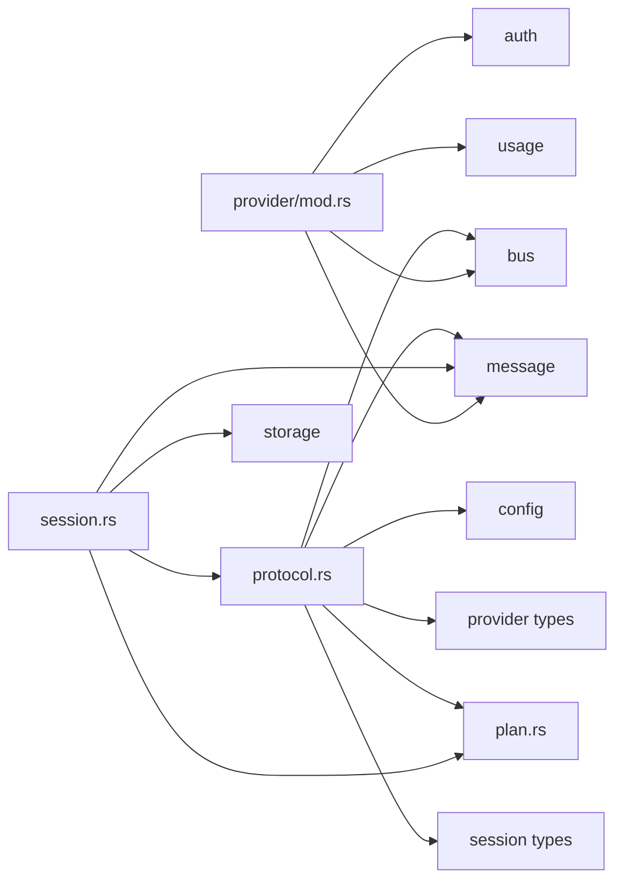

# Provider, Session, and Shared-Contract Boundary Audit

Status: 2026-04-16 audit note

This document audits the current provider, session, and shared-contract seams in the jcode workspace and recommends the next **realistic** crate moves that improve modularity without creating high-churn dependency cycles.

It is intentionally conservative. The goal is to identify boundaries that are both:

- structurally useful
- low enough churn to be worth turning into workspace crates now

See also:

- [`COMPILE_PERFORMANCE_PLAN.md`](./COMPILE_PERFORMANCE_PLAN.md)
- [`REFACTORING.md`](./REFACTORING.md)
- [`SERVER_ARCHITECTURE.md`](./SERVER_ARCHITECTURE.md)
- [`MULTI_SESSION_CLIENT_ARCHITECTURE.md`](./MULTI_SESSION_CLIENT_ARCHITECTURE.md)

## Executive summary

The next clean workspace moves are **not** a full `Provider` trait extraction and **not** a full `session.rs` split.

The best next steps are:

1. **Add a small `jcode-shared-contracts` crate** for the serde-only protocol/session overlap types that already act like shared contracts.
2. **After that, add a narrow `jcode-session-contracts` crate** for session metadata/replay/view structs that are widely reused but do not need the full `Session` runtime.
3. **If we want one more provider-side move before a larger provider refactor, extract the pure provider identity/selection layer** into `jcode-provider-core` or a small `jcode-provider-selection` crate.

The main things to avoid for now:

- extracting `Provider` / `EventStream` into a shared crate
- extracting all of `protocol.rs`
- extracting all of `session.rs`
- moving `provider_catalog.rs` wholesale into a crate

Those look tempting, but today they would mostly convert existing high-churn coupling into workspace-crate churn.

## Current workspace boundary state

Already landed and directionally good:

- `crates/jcode-provider-metadata`
- `crates/jcode-provider-core`
- `crates/jcode-provider-openrouter`
- `crates/jcode-provider-gemini`

A useful property of the current extracted crates is that they are still **leaf-like support crates**.

Current local workspace dependency picture for those crates:

- `jcode-provider-core`: no local workspace deps
- `jcode-provider-metadata`: no local workspace deps
- `jcode-provider-openrouter`: no local workspace deps
- `jcode-provider-gemini`: no local workspace deps

That is the right pattern to preserve. The next crate moves should keep producing small, leaf-ish crates instead of creating new central hubs that everything recompiles through.

## Hotspots and coupling observed

Relevant file sizes in the main crate:

- `src/session.rs`: 2730 lines
- `src/provider/mod.rs`: 2283 lines
- `src/protocol.rs`: 1198 lines
- `src/provider/openrouter.rs`: 1132 lines
- `src/provider/gemini.rs`: 1117 lines
- `src/provider_catalog.rs`: 775 lines
- `src/plan.rs`: 17 lines

High-level coupling observed during the audit:

- `src/provider/mod.rs` directly references `auth`, `logging`, `bus`, `message`, and `usage`
- `src/session.rs` directly references `message`, `protocol`, `plan`, `storage`, and support modules
- `src/protocol.rs` directly references `bus`, `config`, `message`, `plan`, `provider`, `session`, and `side_panel`
- `src/provider_catalog.rs` is especially tied to `env`, `storage`, and `logging`

That means the biggest blockers are not the already-extracted support crates. They are the remaining mixed runtime/facade modules in the main crate.

## Dependency shape

The key architectural smell is that some types that are effectively **shared contracts** still live inside large mixed-responsibility modules.

## Provider boundary audit

### What is already in a good state

The existing provider crate moves were well chosen:

- `jcode-provider-metadata` holds stable login/profile catalog data
- `jcode-provider-core` holds route/cost/shared HTTP client/core value types
- `jcode-provider-openrouter` holds OpenRouter-specific catalog/cache/ranking/model-spec support
- `jcode-provider-gemini` holds Gemini Code Assist schema/types/support helpers

These are all relatively pure support surfaces.

### What is not a good next move yet

### Do not extract `Provider` / `EventStream` yet

`src/provider/mod.rs` is still deeply entangled with:

- `crate::message::{Message, StreamEvent, ToolDefinition}`
- auth-driven behavior
- runtime selection/failover
- logging and bus notifications
- provider-specific compaction and transport behavior

Moving the trait now would likely create a new shared crate that still changes whenever runtime/provider behavior changes.

That would improve directory layout, but not boundary quality.

### Do not move `provider_catalog.rs` wholesale yet

`src/provider_catalog.rs` is not just metadata. It currently mixes:

- catalog/profile values
- env mutation
- auth probing helpers
- config-file lookup
- logging/warnings

That facade is still too runtime-aware to become a clean leaf crate as-is.

### Best realistic provider move

### Option A: extract provider identity + pure selection

Most realistic provider-side move after the current support crates:

- move the provider identity enum currently represented by `ActiveProvider`
- move `src/provider/selection.rs`
- optionally move pure fallback ordering helpers that do not depend on auth/runtime state

Target:

- either a new `crates/jcode-provider-selection`
- or a small `provider_identity` / `selection` module inside `jcode-provider-core`

Why this is realistic:

- `selection.rs` is already pure logic
- it does not need `Message`, `EventStream`, auth state, or storage
- it would shave some policy code out of `src/provider/mod.rs`
- it creates a stable place for provider-order and provider-name normalization rules

Why this should stay narrow:

- once the code starts touching account failover, auth checks, runtime availability, or logging, it stops being a good crate boundary

## Session boundary audit

### Why `session.rs` should not be extracted wholesale yet

`src/session.rs` is large, but it is not one thing.
It currently mixes:

- persisted session data structures
- runtime session state
- journaling / file persistence helpers
- replay-event persistence
- startup/remote snapshot helpers
- image rendering helpers

A whole-file crate extraction would drag in more coupling than it removes.

Current blockers:

- `StoredMessage` depends on `crate::message::{ContentBlock, Message, Role, ToolCall}`
- replay-event types currently depend on `crate::protocol::SwarmMemberStatus`
- replay-event plan snapshots currently depend on `crate::plan::PlanItem`
- the session module also owns persistence and storage concerns

So the next move should be a **session-contract slice**, not a full session crate.

### Best realistic session move

### Option B: narrow `jcode-session-contracts`

After shared contracts are extracted first, move the session types that are:

- serde-only
- reused outside `session.rs`
- not tied to `storage` or the full `Session` runtime

Good first candidates:

- `SessionStatus`
- `SessionImproveMode`
- `StoredDisplayRole`
- `StoredTokenUsage`
- `StoredCompactionState`
- `StoredMemoryInjection`
- `RenderedImageSource`
- `RenderedImage`
- `StoredReplayEvent` and `StoredReplayEventKind` once their swarm/plan payloads stop pointing back into `protocol.rs`

What should stay in the main crate for now:

- `Session`
- `StoredMessage`
- session journaling/file IO
- session startup/load/save orchestration
- message-to-image rendering functions

Why this is realistic:

- these contract structs already have broad fanout across agent, server, replay, and TUI code
- they are semantically session-level contracts, not session-runtime behavior
- the move becomes much cleaner once shared swarm/protocol payloads are extracted first

## Shared-contract boundary audit

This is the highest-leverage next seam.

There are several small, serde-only types that are clearly shared contracts already, but they currently live inside large modules:

- `PlanItem` in `src/plan.rs`
- `TranscriptMode` in `src/protocol.rs`
- `CommDeliveryMode` in `src/protocol.rs`
- `FeatureToggle` in `src/protocol.rs`
- `SessionActivitySnapshot` in `src/protocol.rs`
- `SwarmMemberStatus` in `src/protocol.rs`
- `AgentInfo` in `src/protocol.rs`
- `ContextEntry` in `src/protocol.rs`
- `SwarmChannelInfo` in `src/protocol.rs`
- `AwaitedMemberStatus` in `src/protocol.rs`
- `NotificationType` in `src/protocol.rs`

These are used across server, tool, TUI, replay, and session persistence flows, but they do not need the rest of `protocol.rs`.

### Best overall next move

### Option C: add `jcode-shared-contracts`

Recommended contents for the first pass:

- `PlanItem`
- `TranscriptMode`
- `CommDeliveryMode`
- `FeatureToggle`
- `SessionActivitySnapshot`
- swarm-related status/info structs:
  - `SwarmMemberStatus`
  - `AgentInfo`
  - `ContextEntry`
  - `SwarmChannelInfo`
  - `AwaitedMemberStatus`
  - `NotificationType`

Why this is the best next move:

- it breaks the `session.rs -> protocol.rs / plan.rs` dependency knot at the contract layer
- it gives replay/session persistence a clean dependency for swarm and plan snapshots
- it trims `protocol.rs` without trying to extract `Request` and `ServerEvent` yet
- it preserves the current successful pattern of a small, leaf-ish support crate with mostly `serde` types

Minimal dependency goal:

- `serde`
- nothing else, if possible

## Recommended sequencing

### Phase 1

Create `crates/jcode-shared-contracts`.

Expected immediate moves:

- `src/plan.rs` contents
- the small shared structs/enums listed above from `src/protocol.rs`

Keep in main crate for now:

- `Request`
- `ServerEvent`
- `encode_event` / `decode_request`

### Phase 2

Create `crates/jcode-session-contracts`.

Do this only after Phase 1, so session replay types can point at `jcode_shared_contracts::*` instead of `crate::protocol::*` or `crate::plan::*`.

### Phase 3

If a provider-side move is still desired before a larger provider refactor, extract only:

- provider identity enum
- pure selection/fallback ordering helpers

Do **not** include:

- `Provider` trait
- `EventStream`
- account failover
- auth state inspection
- runtime provider availability
- logging/bus side effects

## Moves to explicitly defer

These should be treated as later-stage refactors, not next-step crate moves.

### Defer: full `protocol.rs` crate

Reason:

- `Request` and `ServerEvent` still pull in `message`, `provider`, `session`, `side_panel`, and `bus`
- extracting the whole file now would create a broad, high-fanout crate instead of a clean contract crate

### Defer: full `session.rs` crate

Reason:

- the file mixes contracts, runtime state, rendering, journaling, and persistence
- `StoredMessage` still anchors the session layer to `message.rs`

### Defer: full provider trait / impl crate split

Reason:

- the trait seam is still mixed with runtime behavior and provider-specific execution policy
- moving it now would likely centralize churn rather than reduce it

### Defer: full `provider_catalog.rs` extraction

Reason:

- the file is still a runtime facade around env/config/auth probing, not just metadata

## Why this order avoids dependency-cycle mistakes

The sequence matters:

1. extract small shared contracts first
2. then extract session contracts that depend on those shared contracts
3. only then revisit deeper provider or protocol extraction

That order avoids creating crates that need to point back into the main crate for basic DTOs, which is exactly how high-churn dependency cycles usually start.

## Recommended concrete next actions

1. Add `crates/jcode-shared-contracts` with serde-only types from `plan.rs` and the small protocol/session overlap set.
2. Update `session.rs`, `protocol.rs`, server, tool, replay, and TUI imports to point at that crate.
3. Re-measure touched-file compile times for:
   - `src/session.rs`
   - `src/protocol.rs`
   - `src/provider/mod.rs`
4. If the new seam stays clean, follow with a narrow `jcode-session-contracts` extraction.
5. Revisit provider trait extraction only after message/runtime/provider-execution seams are thinner.
